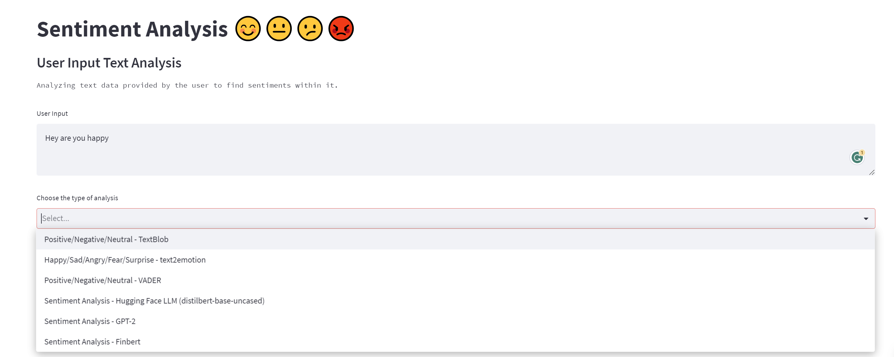
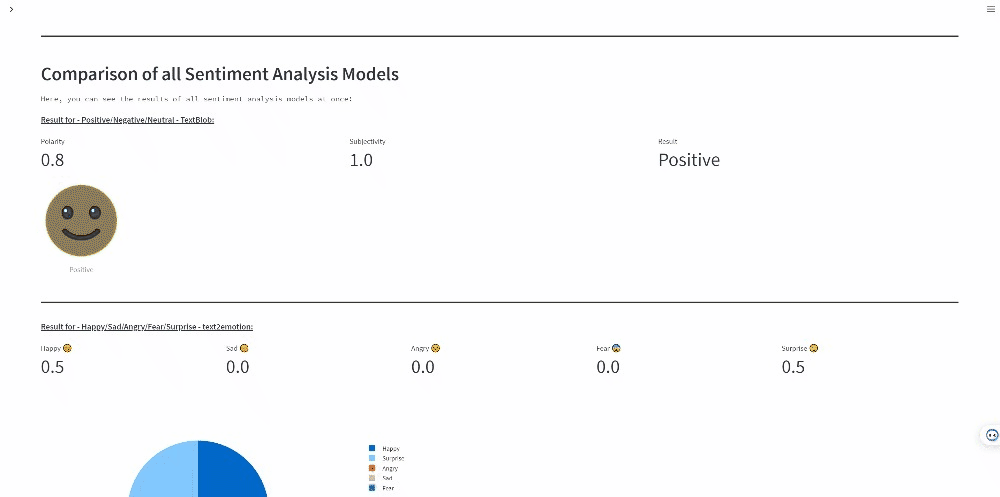

## Sentiment analysis using Streamlit and Hugging-Face🤗


## Project Specifications

**Below are the libraries and frameworks used to create the project**
- **Web Framework** :- Streamlit
- **Graphs and Images** :- PIL, plotly
- **Libraries for sentiment analysis** :- textblob, nltk(vader), text2emotion, Hugging Face Pretrained models.

<br>

## Project Components

**Text** - Applying sentiment analysis on text given by the user.

<br>

## Images

- UI Image:
 

- Models Dropdown:
  

- Working prototype:
  


## Getting started with this project

- Clone the repo
  ```
  git clone https://github.com/Ravikumar10593-hub/Text-Sentiment-Analysis-Using-Steamlit-and-Huggingface.git
  ```
- `pip install -r requirements.txt`
**_NOTE_** : Before doing pip install create a virtual env (Read [this](https://medium.com/dev-genius/no-more-airflow-mage-ai-%EF%B8%8F-cfbff09f5276) for step by step guide)
- `streamlit run app_new.py`
